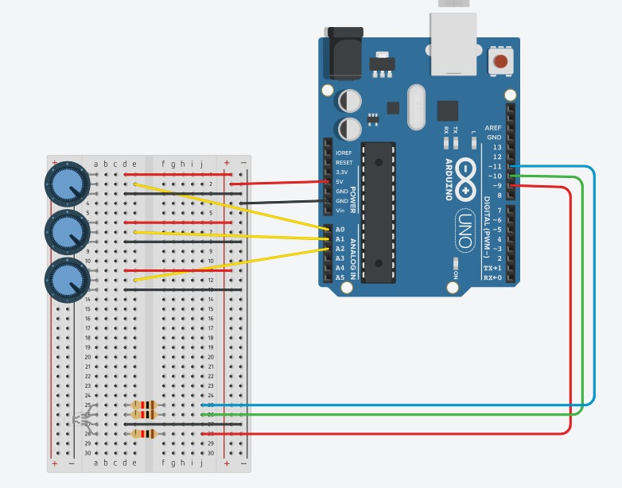
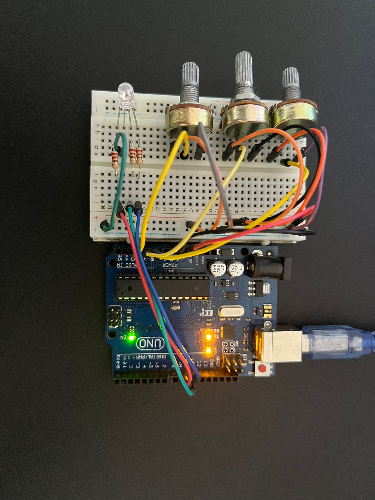
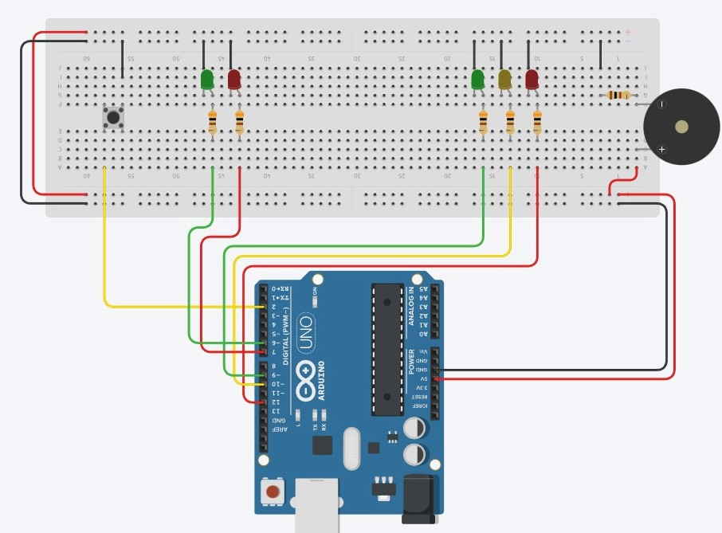
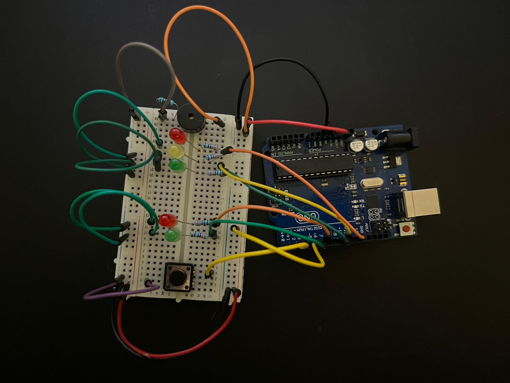
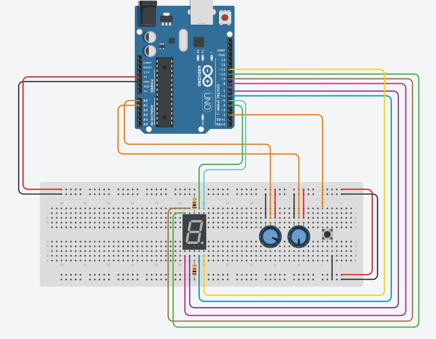
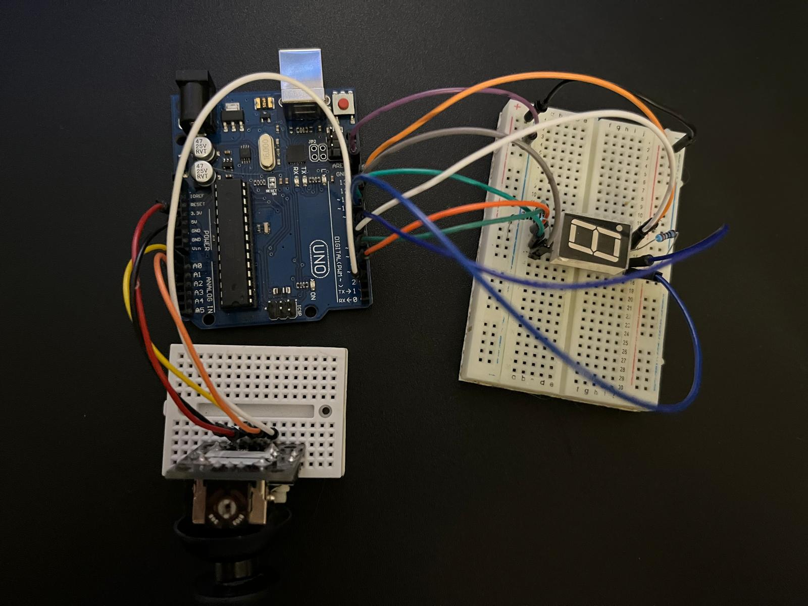
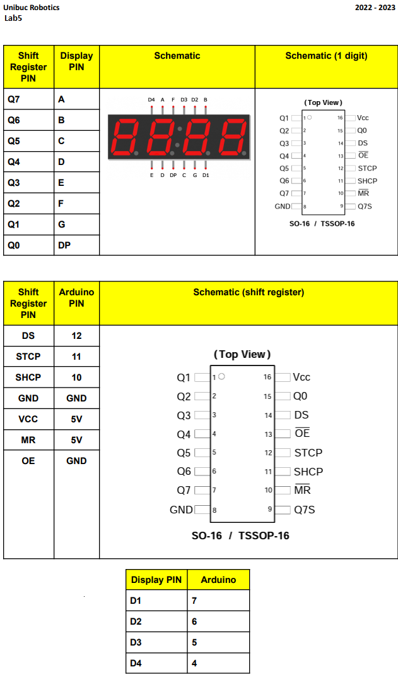
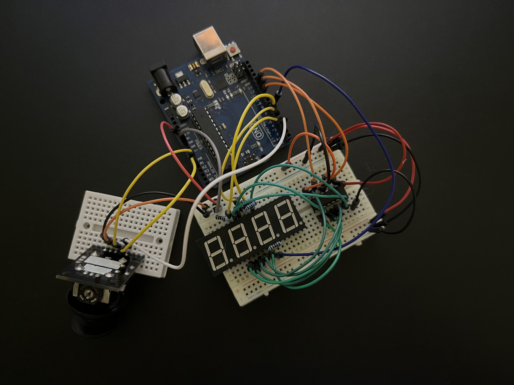
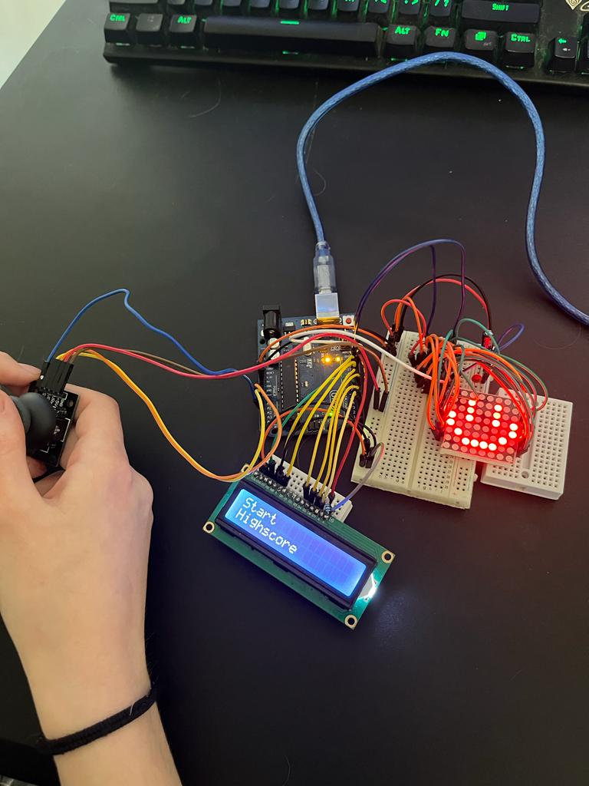

# Introduction To Robotics (2022-2023)
A repository to learn the basics of robotics for the course of Introduction To Robotics (3rd year, Faculty of Mathematics and Informatics, University of Bucharest) 
This includes: homework requirements, implementation details (code, image files, description).

## Homework 1
### Requirements
**Components**
> RBG  LED  (1  minimum),  potentiometers  (3  minimum),resistors and wires (per logic)

**Technical Task**
> Use a separat potentiometer in controlling each of the color of the RGB led (Red, Green and Blue). The control must be done with digital electronics(aka you must read the value of the potentiometer with Arduino, and write a mapped value to each of the pins connected to the led).

### Solution
* The circuit diagram:

* The physical setup:

* The code can be found [here](homework/homework_1/RGBWithPotentiometer.ino)
* The video showcasing the functionality can be found [here](https://youtu.be/d9IHBvmgFHg)

## Homework 2
### Requirements
**Components**
> 5 LEDs (2 red, 2 green and 1 yellow), 1 buzzer, 1 button, resistors and wires (per logic)

**Technical Task**
> Build the traffic lights for a crosswalk. Use 2 LEDs to represent the traffic lights for people (red and green) and 3 LEDs to represent the traffic lights for cars (red, yellow and green). Below see the states it needs to go through.

| State number | Lights for cars | Lights for pedestrians | Sound | Duration |
| --- | --- | --- | --- | --- |
| `1` (default) | Green | Red | No sound | Indefinite, changed by pressing the button, then lasts **8** seconds |
| `2` (yellowForDrivers) | Yellow | Red | No sound | **3** seconds |
| `3` (freeForPedestrians) | Red | Green | Beep at constant interval | **8** seconds |
| `4` (pedestriansHurry) | Red | Green (blinking) | Beeping at faster interval | **4** seconds |

### Solution
* The circuit diagram:

* The physical setup:

* The code can be found [here](homework/homework_2/trafficLights.ino)
* The video showcasing the functionality can be found [here](https://youtu.be/yoPrPJzQH1o)

## Homework 3
### Requirements
**Components**
> 1 7-segment display, 1 joystick, resistors and wires (per logic)

**Technical Task**
> Use the joystick to control the position of the segment and ”draw” on the display.
> The movement between segments should be natural (meaning they should jump from 
> the current positiononly to neighbors, but without passing through ”walls”.

**The system has the following states:**
* **State 1** (default, but also initiated after a button press in State 2):
  
    Current LED position blinking. Can use the joystick to move from one position to  neighbors. Short pressing the button toggles state2. Long pressing the button in state 1 resets the entire display by turning all the segments **OFF** and moving the current position to the decimal point.

* **State 2** (initiated after a button press in State 1):   
  
    The current segment stops blinking, adopting the state of the segment  before selection (ON or OFF). Toggling the X axis should change the segment state from  ON to OFF or from OFF to ON. Clicking the joystick should save the segment state and exit back to state 1.

### Solution
* The circuit diagram *(2 potentiometers and a button to simulate a joystick)*:

* The physical setup:

* The code can be found [here](homework/homework_3/segmentWithJoystick.ino)
* The video showcasing the functionality can be found [here](https://youtu.be/Gb5oqYhjoqA)

## Homework 4
### Requirements
**Components**
> A joystick, a 4 digit 7-segment display, a 74hc595 shift register, resistors and wires (per logic)

**Technical Task**
> Use the joystick to move through the 4 digit 7segment displays digits, 
> press the button to lock in on the current digit and use the other axis 
> to increment or decrement the number. Long press the button to reset 
> all the digit values and the current position.

**The system has the following states:**
* **State 1**:
  
    Use a joystick axis to cycle through the 4 digits. Using the other axis does nothing. A blinking decimal point shows the current digit position. When pressing the button, you lock in on the selected digit and enter the second state.

* **State 2** (initiated after a button press in State 1):   
  
    The decimal point stays always on, no longer blinking and you can no longer cycle through the 4 digits. Instead, using the other axis, you can increment or decrement the number on the current digit IN HEX (aka from 0 to F). Pressing the button again returns you to the previous state.

* **State 3** (reset):   
  
    Toggled by long pressing the button only in the first state. When resetting, all the digits go back to 0 and the current position is set to the first (rightmost) digit, in the first state.

### Solution
* The connections can be seen here (with the exception of joystick)

* The physical setup:

* The code can be found [here](homework/homework_4/4digitsDisplayWithJoystick.ino)
* The video showcasing the functionality can be found [here](https://www.youtube.com/shorts/QC3vCTcmF3E)

## Homework 5
### Requirements
**Components**
> A joystick, a matrix with driver, a LCD display, resistors and wires (per logic)

**Technical Task**
> Create menu and a mini-game

### Solution

* The physical setup:

* The code can be found [here](homework/homework_5/game.ino)
* The video showcasing the functionality can be found [here](https://youtu.be/IdPWAjGZ1as)

## Matrix project

> :warning: The matrix project has it's own repository. See [this](https://github.com/Daria602/Arduino-Snake) to check it out.

### Code
The code for this project can be found [here](homework/matrixProject/snake.ino)

